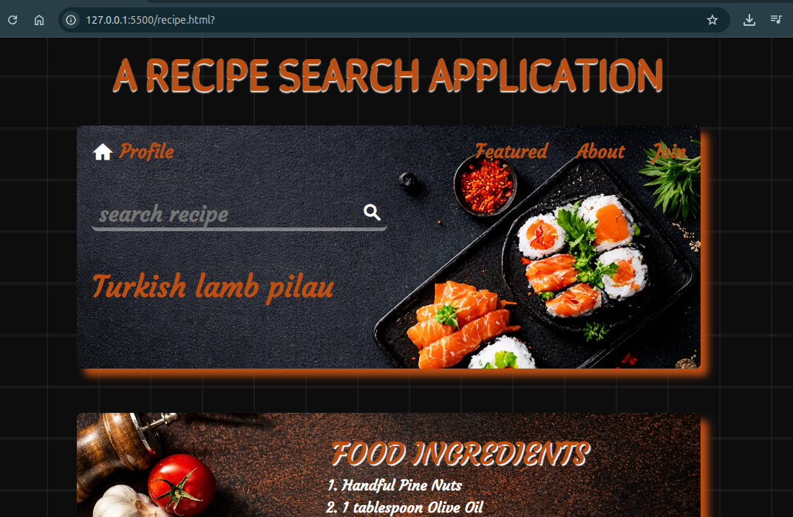
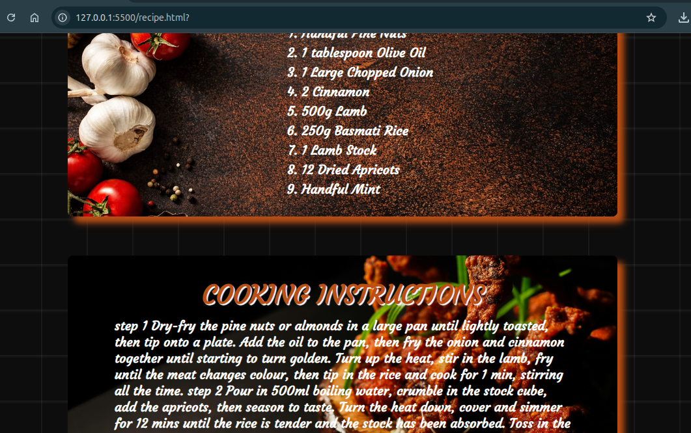

# 🍽️ RECIPE WEB APPLICATION

A simple and clean web application that allows users to search for meals and instantly get **ingredients** and **cooking instructions** powered by [TheMealDB API](https://www.themealdb.com/).

---

## 🔥 Features

- 🔍 Search any meal by name
- 📋 Displays full list of ingredients with measurements
- 📖 Step-by-step cooking instructions
- ⚠️ Error handling for invalid or empty searches
- 🧹 Clears previous results on every new search

---

## 🛠️ Built With

- **HTML** — Page structure
- **CSS** — Styling and layout
- **JavaScript** — Logic and API calls
- **TheMealDB API** — Meal data source (free, no key required)

---

## 📁 Project Structure

```
recipe-app/
│
├── index.html       
├── recipe.css       
└── recipe.js         
```

---

## 🚀 Getting Started

No installations or dependencies needed. Just open the project locally.

### 1. Clone the repository

```bash
git clone https://github.com/Aucire/RECIPEE-WEB-APPLICATION.git
```

### 2. Open in browser

```bash
cd recipe-finder
open index.html
URL http://127.0.0.1:5500/recipe.html?
```

Or simply double-click `index.html` to open it in your browser.

---

## 🔌 API Reference

This app uses the free [TheMealDB API](https://www.themealdb.com/api.php).

**Endpoint used:**

```
https://www.themealdb.com/api/json/v1/1/search.php?s={mealName}
```

| Parameter | Type | Description |
|---|---|---|
| `s` | `string` | Name of the meal to search |

**Example response fields used:**

| Field | Description |
|---|---|
| `strMeal` | Name of the meal |
| `strIngredient1–20` | List of ingredients |
| `strMeasure1–20` | Measurements for each ingredient |
| `strInstructions` | Full cooking instructions |

---

## 💡 How It Works

1. User types a meal name in the search bar
2. On button click, a `fetch()` request is sent to TheMealDB API
3. The app parses the response and dynamically creates DOM elements
4. Ingredients and instructions are rendered on the page
5. If no meal is found, an error message is displayed

---

## 🖼️ Screenshot

> 
> 
> 

```

```

---

## ⚠️ Known Limitations

- Search is name-based only (no filter by ingredient or category)
- Displays all matched meals — no pagination yet
- Requires an internet connection to fetch from the API

---

## 🛣️ Future Improvements

- [ ] Add meal category filter
- [ ] Add a favorites / saved recipes feature
- [ ] Make it fully responsive on mobile
- [ ] Add loading spinner during fetch
- [ ] Display meal image from API

---

## 📄 License

This project is open source and available under the [MIT License](LICENSE).

---

## 🙌 Acknowledgements

- [TheMealDB](https://www.themealdb.com/) for the free meals API

---